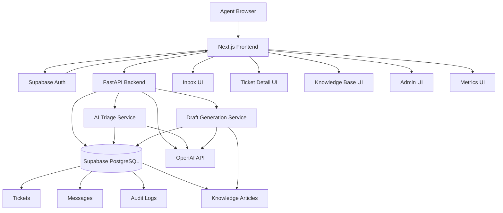

## Architecture

See the full architecture document here:

[Architecture Document](docs/ARCHITECTURE.md)

# Inbox Pilot

Inbox Pilot is an AI-assisted support triage system for internal support teams. It helps agents prioritize tickets, classify urgency, extract useful context, generate grounded draft replies, and keep humans accountable for final approval.

This is not a customer-facing chatbot. It is an internal operations tool designed to reduce support-agent cognitive load while preserving human review and auditability.

## What It Does

- Authenticates agents using Supabase Auth
- Displays a ticket inbox with filters, pagination, ownership, SLA status, and priority signals
- Lets agents assign, close, and manage tickets
- Tracks SLA risk and overdue tickets
- Runs AI triage on tickets
- Classifies category and priority
- Extracts useful entities such as keywords, order IDs, and customer email when available
- Flags tickets that need human review
- Stores AI results in the database
- Generates grounded draft replies using approved knowledge base articles
- Supports human edit, approve, and reject flow for drafts
- Tracks audit history internally
- Provides admin routing rules and operational metrics dashboards

## Why This Project Exists

Support teams often waste time manually reading tickets, guessing urgency, searching internal knowledge articles, and writing repetitive replies.

Inbox Pilot models a realistic internal support workflow:

```txt
ingest → analyze - draft - approve - resolve - learn
```

The goal is not to replace support agents. The goal is to help them work faster by handling triage, prioritization, and first-draft generation while keeping humans responsible for final decisions.

## Tech Stack

### Frontend

- Next.js
- React
- TypeScript
- Supabase Auth
- CSS/Tailwind-style utility classes and inline UI styling

### Backend

- FastAPI
- Python
- SQLAlchemy
- PostgreSQL
- Supabase-hosted Postgres
- OpenAI API for AI analysis and grounded drafting

### Database

- Supabase PostgreSQL
- Tables for tickets, messages, audit logs, and knowledge articles

## Core Features

### Ticket Inbox

The inbox gives agents a real support queue experience:

- Search by subject
- Filter by status, priority, category, overdue tickets
- Sort by created date
- Pagination
- Quick assignment
- SLA badges
- Priority badges
- Overdue highlighting

### Ticket Detail Page

Each ticket includes:

- Ticket metadata
- SLA status
- AI analysis panel
- Grounded draft panel
- Message history
- Human approval controls

Manager-only controls include:

- Assign ticket
- Close ticket
- Set SLA
- Clear SLA

### AI Triage

AI analysis classifies tickets and stores structured results:

- Suggested category
- Suggested priority
- Confidence score
- Summary
- Extracted entities
- Human review flag
- Failure handling

The system validates AI output before saving it and falls back safely if the response is not valid.

### Knowledge Base

Agents can maintain approved support knowledge articles.

Knowledge articles are used for grounded draft generation so responses are based on internal support policy instead of free-form AI output.

### Grounded Draft Generation

Drafts are generated using:

- Ticket subject
- Ticket messages
- AI triage output
- Matching knowledge base articles

Agents can:

- Generate a draft
- Edit draft text
- Approve draft
- Reject draft

This keeps the system human-in-the-loop.

### Admin Controls

The admin page models routing configuration:

- Billing escalation rules
- Login recovery rules
- Refund review rules
- Active/inactive rule states
- SLA targets
- Assigned owners

### Metrics Dashboard

The metrics page shows operational health:

- Open ticket count
- SLA breach rate
- AI success rate
- AI latency
- AI health checks
- Queue load
- Draft generation stats
- Approval rate

## Architecture



## Main Workflow

```txt
1. A customer support ticket enters the inbox

2. The agent opens the ticket

3. AI analyzes the ticket and:
   - predicts category
   - predicts priority
   - extracts useful details
   - flags risky tickets for human review

4. The system searches approved knowledge base articles

5. AI generates a grounded draft reply using:
   - ticket details
   - conversation history
   - knowledge articles

6. The agent reviews and edits the draft

7. The agent approves or rejects the response

8. The system stores:
   - AI analysis
   - draft history
   - approval actions
   - audit logs
```

## Database Model

### tickets

Stores the main support ticket and AI/draft metadata.

Important fields:

- subject
- status
- priority
- category
- assignee
- due_at
- ai_status
- ai_category
- ai_priority
- ai_confidence
- ai_entities
- ai_summary
- ai_last_error
- draft_reply
- draft_status
- draft_kb_refs
- draft_last_error

### messages

Stores ticket conversation messages.

Important fields:

- ticket_id
- sender_type
- body
- created_at

### audit_logs

Stores internal traceability events.

Important fields:

- ticket_id
- actor
- action
- meta_json
- created_at

### knowledge_articles

Stores approved support knowledge used for grounded draft generation.

Important fields:

- title
- body
- category
- tags
- is_active

## API Overview

### Tickets

```txt
GET    /tickets
POST   /tickets
GET    /tickets/{ticket_id}
PATCH  /tickets/{ticket_id}
```

### Messages

```txt
GET    /tickets/{ticket_id}/messages
POST   /tickets/{ticket_id}/messages
```

### AI Triage

```txt
POST   /tickets/{ticket_id}/analyze
```

### Drafts

```txt
POST   /tickets/{ticket_id}/draft
PATCH  /tickets/{ticket_id}/draft
```

### Knowledge Base

```txt
GET    /knowledge
POST   /knowledge
```

### Audit

```txt
GET    /tickets/{ticket_id}/audit
```

### Metrics

```txt
GET    /metrics/summary
```

## Local Setup

### 1. Clone the repo

```bash
git clone https://github.com/Sumanareddy13/inbox-pilot.git
cd inbox-pilot
```

### 2. Backend setup

```bash
cd apps/api
python -m venv .venv
.venv\Scripts\activate
pip install -r requirements.txt
```

Create:

```txt
apps/api/.env
```

Use placeholders like this:

```env
DATABASE_URL=your_supabase_postgres_connection_string
SUPABASE_PROJECT_URL=https://your-project.supabase.co
OPENAI_API_KEY=your_openai_api_key
OPENAI_MODEL=gpt-4.1-mini
```

Run backend:

```bash
python -m uvicorn main:app --reload
```

Backend runs on:

```txt
http://127.0.0.1:8000
```

API docs:

```txt
http://127.0.0.1:8000/docs
```

### 3. Frontend setup

```bash
cd apps/web
npm install
```

Create:

```txt
apps/web/.env.local
```

Use placeholders like this:

```env
NEXT_PUBLIC_API_BASE=http://127.0.0.1:8000
NEXT_PUBLIC_ASSIGNEES=Sam,Alex,Riya,Sumana
NEXT_PUBLIC_SUPABASE_URL=https://your-project.supabase.co
NEXT_PUBLIC_SUPABASE_ANON_KEY=your_supabase_anon_key
NEXT_PUBLIC_USER_ROLE=admin
```

Run frontend:

```bash
npm run dev
```

Frontend runs on:

```txt
http://localhost:3000
```

## Demo Flow

Use this flow when showing the project:

1. Login with Supabase Auth
2. Open the Inbox
3. Show filters, priority, assignment, and SLA status
4. Open a billing/payment ticket
5. Run AI Analysis
6. Show category, priority, confidence, summary, and human review flag
7. Open Knowledge Base and show support article
8. Generate Grounded Draft
9. Edit the draft
10. Approve or reject the draft
11. Show Metrics dashboard
12. Show Admin routing rules

## Key Design Decisions

### Human-in-the-loop by default

AI can analyze and draft, but agents approve final customer-facing responses.

### Grounded drafting

Drafts are based on approved knowledge articles instead of only raw AI generation.

### Auditability

Important workflow events are stored as audit logs for traceability.

### Operational realism

The project includes SLA tracking, assignment, metrics, admin controls, failure states, and retry-aware AI processing.

### Safe AI output handling

The backend validates structured AI output before saving it. If AI output is invalid or fails, the system records the failure instead of silently breaking the workflow.

## Current Limitations

This is a demo-ready MVP, not a fully productionized enterprise system.

Known future improvements:

- Replace in-process async behavior with Redis/Celery or RQ workers
- Add real role-based access control in the backend
- Add vector embeddings for semantic knowledge search
- Add duplicate ticket detection
- Add websocket updates for live ticket refresh
- Connect metrics dashboard fully to backend aggregation
- Add deployment-ready infrastructure configuration
- Add automated test coverage

## Security Notes

Do not commit real secrets.

Keep these files ignored:

```txt
.env
.env.local
apps/api/.env
apps/web/.env.local
```

Use environment variables for:

- Supabase database URL
- Supabase anon key
- OpenAI API key
- Supabase project URL

## Project Status

Inbox Pilot is demo-ready.

It includes the main end-to-end workflow:

```txt
ticket intake - AI triage - knowledge-grounded draft - human approval - operational visibility
```

