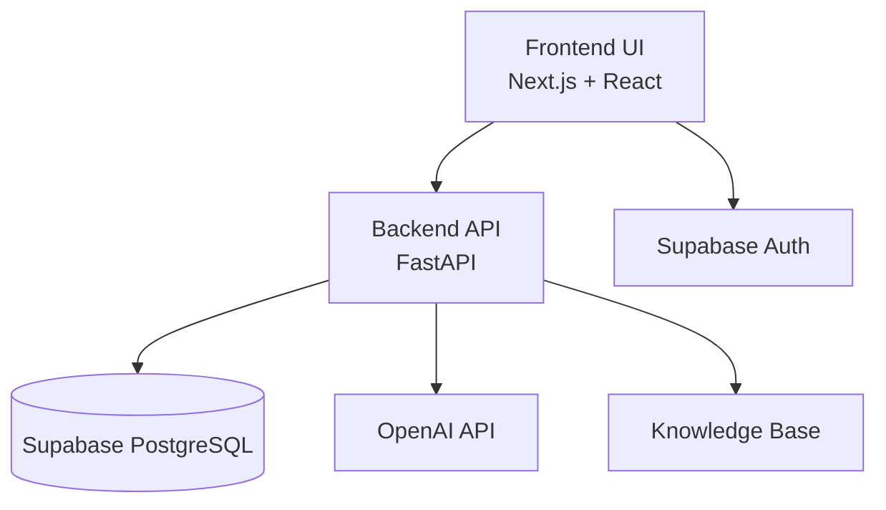

# Inbox Pilot Architecture

## What This System Does

Inbox Pilot helps support teams handle customer tickets faster.

Instead of manually reading every ticket and writing every reply from scratch, the system helps agents by:

- analyzing incoming tickets
- identifying urgency and category
- suggesting priorities
- generating draft responses using approved support knowledge
- keeping humans in control of final decisions

The system is designed to reduce support-agent workload, not replace agents.

---

# Simple System Flow


---

# How the Pieces Work Together



---

# Frontend

The frontend is the support dashboard agents use every day.

It includes:

- Inbox page
- Ticket detail page
- AI analysis view
- Draft approval flow
- Knowledge base
- Metrics dashboard
- Admin controls

Built with:

- Next.js
- React
- TypeScript

---

# Backend

The backend handles all business logic.

Responsibilities include:

- ticket APIs
- AI analysis
- draft generation
- database updates
- audit logging
- metrics
- authentication checks

Built with:

- FastAPI
- Python
- SQLAlchemy

---

# Database

The database stores:

- tickets
- messages
- AI analysis results
- generated drafts
- audit history
- knowledge articles

Hosted on:

- Supabase PostgreSQL

---

# Authentication

Agents log in using Supabase Auth.

The frontend receives a secure access token which is sent to the backend for protected API requests.

---

# AI Workflow

The AI system helps agents in two stages:

## 1. AI Triage

The AI:

- predicts ticket category
- predicts priority
- extracts useful information
- flags risky tickets for human review

Example:

```txt
Category: Billing
Priority: High
Confidence: 90%
Keywords: payment, failed
```

---

## 2. Grounded Draft Generation

The system searches approved support knowledge articles.

AI then generates a response draft using:

- ticket details
- message history
- matching knowledge articles

Agents can:

- edit drafts
- approve drafts
- reject drafts

Humans always make the final decision.

---

# Operational Features

The system also includes:

- SLA tracking
- overdue ticket detection
- assignment workflows
- routing rules
- AI health metrics
- queue monitoring
- audit logging

These features make the project feel closer to a real internal support tool instead of a basic CRUD app.

---

# End-to-End Workflow

```txt
Customer Ticket
        ↓
Inbox Queue
        ↓
AI Analysis
        ↓
Knowledge Search
        ↓
Draft Generation
        ↓
Human Review
        ↓
Approval / Rejection
        ↓
Resolution + Audit Logging
```

---

# Future Improvements

Possible next steps:

- Redis background workers
- vector search for smarter KB retrieval
- duplicate ticket detection
- live websocket updates
- backend role-based permissions
- production deployment
- automated tests